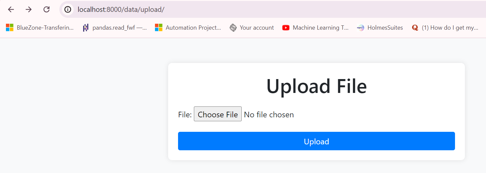
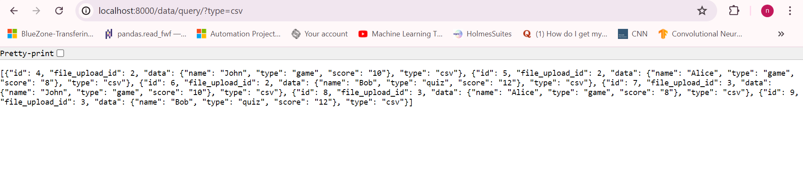
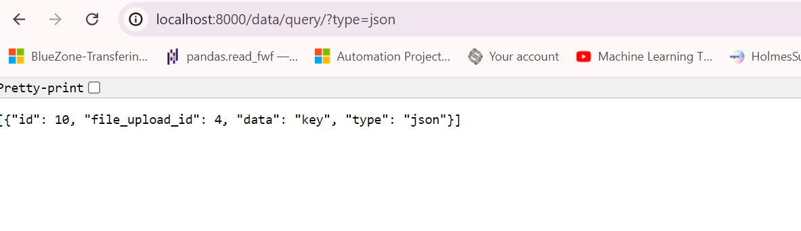

## File Upload and Data Management System
This django project is a web application for uploading and processing files (CSV and JSON) and querying the uploaded data. It follows a modular design using the Strategy and Factory design patterns to handle different file types.

#### Code Structure
```
mysuperdatacompany/
├── dataupload/
│   ├── forms.py
│   ├── models.py
│   ├── views.py
│   ├── templates/
│   │   └── upload.html
│   ├── urls.py
│   ├── __init__.py
│   └── tests.py
├── mysuperdatacompany/
│   ├── __init__.py
│   ├── settings.py
│   ├── urls.py
│   ├── wsgi.py
├── manage.py
└── README.md

```
### Table of Contents

#### Features
Upload CSV and JSON files.
Parse and store the data from uploaded files.
Query and retrieve stored data based on file type.

#### Clone the repository:
```git clone https://github.com/tamilselvanarjun/mysuperdatacompany.git```

Open the command prompt navigate it to mysuperdatacompany directory

```cd mysuperdatacompany```

Install dependencies:

```pip install -r requirements.txt```

#### Please make sure docker service is up and running before executing below commands:

####  Start the development server:
```docker-compose up```

####  API endpoint:

1. Access the file upload form at http://localhost:8000/upload/.
Use the form to upload CSV or JSON files.




2. Query the uploaded data via the API endpoint

To retrieve all the data http://localhost:8000/query/.

To retrieve the all csv file content: http://localhost:8000/data/query/?type=csv



To retrieve all json data stored: http://localhost:8000/data/query/?type=json



#### For any changes in model Run migrations:
```docker-compose run web python manage.py makemigrations```

####  To Migrate changes to DB:
```docker-compose run web python manage.py migrate```

### Design Patterns

####  Strategy Pattern
The Strategy pattern is used to define a family of algorithms (file parsers), encapsulate each one, and make them interchangeable. The FileParser abstract class defines the interface for all file parsers, and concrete implementations (CSVFileParser and JSONFileParser) provide the specific parsing logic.

####  Factory Pattern
The Factory pattern is used to create objects without specifying the exact class of object that will be created. The FileParserFactory class provides a static method to return the appropriate parser instance based on the file extension.

#### Run the unit tests:
Use the following command to run your tests:

#### Prerequisites:
#### Start the Local PostgreSQL Server: 
Make sure your local PostgreSQL server is running and accessible. You can typically start it using a service manager or directly from the command line, depending on your operating system.

#### Run the Django Server: 
Start the Django development server.

#### Configure Django to Use Local PostgreSQL for Testing: 
Update your Django settings to point to the local PostgreSQL instance for testing.
In settings.py go to DATABASES section change HOST = 'localhost'

```python manage.py test```

#### Contributing
Contributions are welcome! Please open an issue or submit a pull request.